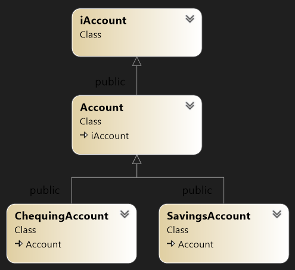

# Workshop 8: Virtual Functions and Abstract Base Classes

* Version 1.0

In this workshop, you are to implement an abstract definition of behavior for a specific type.

## Learning Outcomes

Upon successful completion of this workshop, you will have demonstrated the abilities to:

- define a pure virtual function
- code an abstract base class
- implement behavior declared in a pure virtual function
- explain the difference between an abstract base class and a concrete class
- describe what you have learned in completing this workshop


## Submission Policy


The workshop is divided into one coding part and one non-coding part:

- Part 1 (**LAB**): A step-by-step guided workshop, worth 50% of the workshop's total mark
> Please note that the part 1 section is **not to be started in your first session of the week**. You should start it on your own before the day of your class and join the first session of the week to ask for help and correct your mistakes (if there are any).
- Part 2 (reflection): non-coding part. The reflection doesn't have marks associated with it but can incur a **penalty of max 40% of the whole workshop's mark** if your professor deems it insufficient (you make your marks from the code, but you can lose some on the reflection).
## Due Dates

Depending on the section you are enrolled in, the submission due day of the week may shift a day or two. Please choose the "-due" option of the submitter program to see the exact due date of your section:

```bash
~profname.proflastname/submit 2??/wX/pY -due<ENTER>
```
- Replace **??** with your subject code (`00 or 44`)
- Replace **X** with Workshop number: [`1 to 10`]
- Replace **Y** with the part number: [`1 or 2`]

### Overall workshop due days
- day 1: Workshop open for preview<br/>
  (If you need to check your program with the submitter, you can use `-feedback` option to test the execution without submission)
- day 2: submission opens for both parts 1 and 2
- day 5: (end of day) Part 1 due
- day 8: (end of day) Part 2 due
- day 9: (end of day) submissions rejected

If at the deadline (end of day 8) the workshop is not complete, there is an extension of **one day** when you can submit the missing parts.  **The code parts that are submitted late receive 0%.**  After this extra day, the submission closes; if the workshop is incomplete when the submission closes (missing at least one of the coding or non-coding parts), **the mark for the entire workshop is 0%**.

## Citation

Every file that you submit must contain (as a comment) at the top:<br />
**your name**, **your Seneca email**, **Seneca Student ID** and the **date** when you completed the work.

### For work that is done entirely by you (ONLY YOU)

If the file contains only your work or the work provided to you by your professor, add the following message as a comment at the top of the file:

> I have done all the coding by myself and only copied the code that my professor provided to complete my workshops and assignments.

### For work that is done partially by you.

If the file contains work that is not yours (you found it online or somebody provided it to you), **write exactly which part of the assignment is given to you as help, who gave it to you, or which source you received it from.**  By doing this you will only lose the mark for the parts you got help for, and the person helping you will be clear of any wrongdoing.

> - Add the citation to the file in which you have the borrowed code
> - In the 'reflect.txt` submission of part 2 (DIY), add exactly what is added to which file and from where (or whom).

> :warning: This [Submission Policy](#submission-policy) only applies to the workshops. All other assessments in this subject have their own submission policies.

### If you have helped someone with your code

If you have helped someone with your code. Let them know of these regulations and in your 'reflect.txt' of part 2 (DIY), write exactly which part of your code was copied and who was the recipient of this code.<br />By doing this you will be clear of any wrongdoing if the recipient of the code does not honour these regulations.

## Compiling and Testing Your Program

All your code should be compiled using this command on `matrix`:

```bash
g++ -Wall -std=c++11 -g -o ws file1.cpp file2.cpp ...
```

- `-Wall`: the compiler will report all warnings
- `-std=c++11`: the code will be compiled using the C++11 standard
- `-g`: the executable file will contain debugging symbols, allowing *valgrind* to create better reports
- `-o ws`: the compiled application will be named `ws`

After compiling and testing your code, run your program as follows to check for possible memory leaks (assuming your executable name is `ws`):

```bash
valgrind --show-error-list=yes --leak-check=full --show-leak-kinds=all --track-origins=yes ws
```

- `--show-error-list=yes`: show the list of detected errors
- `--leak-check=full`: check for all types of memory problems
- `--show-leak-kinds=all`: show all types of memory leaks identified (enabled by the previous flag)
- `--track-origins=yes`: tracks the origin of uninitialized values (`g++` must use `-g` flag for compilation, so the information displayed here is meaningful).

To check the output, use a program that can compare text files.  Search online for such a program for your platform, or use *diff* available on `matrix`.

> Note: All the code written in workshops and the project must be implemented in the **sdds** namespace, unless instructed otherwise.

### Custom code submission

If you have any additional custom code, (i.e. functions, classes etc) that you want to reuse in the workshop save them under a module called Utils (`Utils.cpp and Utils.h`) and submit them with your workshop using the instructions in the "[Submitting Utils Module](#submitting-utils-module)" section.

# Part 1 - LAB - Bank Accounts(100%)

In this workshop, you create an inheritance hierarchy for the bank accounts of a bank’s clients. All clients can deposit (i.e., credit) money into their accounts and withdraw (i.e., debit) money from their accounts. Two specific types of accounts exist. Savings accounts earn interest on the money they hold. Checking accounts charge a fee per transaction (i.e., for every credit and debit).  

## Class Hierarchy:
The design of your **Account** hierarchy is illustrated in the following Figure. An interface named **iAccount** exposes the hierarchy’s functionality to a client module that uses its features. The abstract base class named **Account** holds the balance for an account, can credit and debit an account transaction and can expose the current balance in the account. The two account types derive from this base class. The **SavingsAccount** class and the **ChequingAccount** class inherit the properties and functionality of the **Account** base class. 



## Implementation

Implement the following classes:
1) `iAccount`  - the interface to your hierarchy – store it in a file named iAccount.h
2) `Account` - an abstract base class that manages the common operations – store its definition and implementation in files named Account.h and Account.cpp.
3) `SavingsAccount` – a concrete class – store its definition and implementation in files named SavingsAccount.h and SavingsAccount.cpp.
4) `ChequingAccount` – a concrete class – store its definition and implementation in files named ChequingAccount.h and ChequingAccount.cpp.
5) `the Allocator Module` (coded and provided) -  In a separate file named Allocator.cpp the function that allocates dynamic memory for an account based on its dynamic type is provided. Study and understand this function before the final tester program. This function is to be declared in the `iAccount` Interface module (see below)

### `iAccount` Interface:
The iAccount interface includes the following pure virtual public member functions:

- `bool credit(double)` – adds a positive amount to the account balance 
- `bool debit(double)` – subtracts a positive amount from the account balance 
- `void monthEnd()` – applies month-end transactions to the account
- `void display(std::ostream&) const` – inserts account information into an ostream object

This interface also declares a public empty virtual destructor.  
This interface also declares the following helper function (this global function is already coded and is provided in the allocator module and will be used at final submission)

- `iAccount* CreateAccount(const char*, double)` – receives a C-style string identifying the type of account and the initial account balance, creates the account with the starting balance and returns its address.

### `Account` Class  (abstract base class)
The **Account** class derives from the **iAccount** interface.

### Attribute
The current balance (a double value);

### Public constructor and methods

- `Account(double)` – constructor receives either a double holding the initial account balance or nothing. If the amount received is not positive-valued or no amount is received, this function initializes the current balance to 0.0. If the amount received is positive-valued, this function initializes the current account balance to the received amount. 
- `bool credit(double)` – receives an amount to be credited (added) to the account balance and returns the success of the transaction. If the amount received is positive-valued, the transaction succeeds and this function adds the amount received to the current balance. If the amount is not positive-valued, the transaction fails and this function does not add the amount received.
- `bool debit(double)` – receives an amount to be debited (subtracted) from the account balance and returns the success of the transaction. If the amount received is positive-valued, the transaction succeeds and this function subtracts the amount received from the current balance. If the amount is not positive-valued, the transaction fails and this function does not subtract the amount received.

### Protected method

- `double balance() const` – returns the current balance of the account.


## `SavingsAccount` Class (concrete class)

The SavingsAccount class derives from the Account class and holds the interest rate that applies to the account. This class includes the following public member functions:
- `SavingsAccount(double, double)` – constructor receives a double holding the initial account balance and a double holding the interest rate to be applied to the balance. If the interest rate received is positive-valued, this function stores the rate. If not, this function stores 0.0 as the rate to be applied.
- `void monthEnd()` – this modifier calculates the interest earned on the current balance and credits the account with that interest.
- `void display(std::ostream&) const` – receives a reference to an ostream object and inserts the following output on separate lines to the object. The values marked in red are fixed format with 2 decimal places and no fixed field width:

```text
Account type: Savings
Balance: $xxxx.xx
Interest Rate (%): x.xx
```

## Saving Tester Program
```C++
// Workshop 8 - Virtual Functions and Abstract Base Classes
// File: savings_tester.cpp
// Version: 2.0
// Author: Chris Szalwinski, based on previous work by Heidar Davoudi
// Description:
// This file implements the Account class
// revised by Fardad Soleimanloo
/////////////////////////////////////////////////////////////////
#include <iostream>
#include <cstring>
#include "iAccount.h" 
#include "SavingsAccount.h"

using namespace sdds;
using namespace std;

// display inserts account information for client
//
void display(const char* client, iAccount* const acct[], int n) {
	int lineLength = strlen(client) + 22;
	cout.fill('*');
	cout.width(lineLength);
	cout << "*" << endl;
	cout << "DISPLAY Accounts for " << client << ":" << endl;
	cout.width(lineLength);
	cout << "*" << endl;
	cout.fill(' ');
	for (int i = 0; i < n; ++i) {
		acct[i]->display(cout);
		if (i < n - 1) cout << "-----------------------" << endl;
	}
	cout.fill('*');
	cout.width(lineLength);
	cout << "****************************" << endl << endl;
	cout.fill(' ');
}

// close a client's accounts
// 
void close(iAccount* acct[], int n) {
	for (int i = 0; i < n; ++i) {
		delete acct[i];
		acct[i] = nullptr;
	}
}

int main() {
	// Create Accounts for Angelina
	iAccount* Angelina[2];

	// initialize Angelina's Accounts 
	// (in the main program will be done using the allocator module)
	Angelina[0] = new SavingsAccount(400.0,0.05);
	Angelina[1] = new SavingsAccount(400.0, 0.05);
	display("Angelina", Angelina, 2);

	cout << "DEPOSIT $2000 into Angelina’s Accounts ..." << endl;
	for (int i = 0; i < 2; i++)
		Angelina[i]->credit(2000);

	cout << "WITHDRAW $1000 and $500 from Angelina's Accounts ... " << endl;
	Angelina[0]->debit(1000);
	Angelina[1]->debit(500);
	cout << endl;
	display("Angelina", Angelina, 2);

	Angelina[0]->monthEnd();
	Angelina[1]->monthEnd();
	display("Angelina", Angelina, 2);

	close(Angelina, 2);
	return 0;
}

```
## Saving Tester Output
```text
******************************
DISPLAY Accounts for Angelina:
******************************
Account type: Savings
Balance: $400.00
Interest Rate (%): 5.00
-----------------------
Account type: Savings
Balance: $400.00
Interest Rate (%): 5.00
******************************

DEPOSIT $2000 into AngelinaÆs Accounts ...
WITHDRAW $1000 and $500 from Angelina's Accounts ...

******************************
DISPLAY Accounts for Angelina:
******************************
Account type: Savings
Balance: $1400.00
Interest Rate (%): 5.00
-----------------------
Account type: Savings
Balance: $1900.00
Interest Rate (%): 5.00
******************************

******************************
DISPLAY Accounts for Angelina:
******************************
Account type: Savings
Balance: $1470.00
Interest Rate (%): 5.00
-----------------------
Account type: Savings
Balance: $1995.00
Interest Rate (%): 5.00
******************************
```

## `ChequingAccount` Class (concrete class)

The **ChequingAccount** class derives from the **Account** class and holds the transaction fee and month-end fee to be applied to the account. 

### Attributes

- transaction fee (double)
- monthly fee (double)

### public constructor and methods

- `ChequingAccount(double, double, double)` – constructor receives a double holding the initial account balance, a double holding the transaction fee to be applied to the balance and a double holding the month-end fee to be applied to the account. If the transaction fee received is positive-valued, this function stores the fee. If not, this function stores 0.0 as the fee to be applied. If the monthly fee received is positive-valued, this function stores the fee. If not, this function stores 0.0 as the fee to be applied.
- `bool credit(double)` – this modifier credits the balance by the amount received and if successful debits the transaction fee from the balance. This function returns true if the transaction succeeded; false otherwise.
- `bool debit(double)` – this modifier debits the balance by the amount received and if successful debits the transaction fee from the balance. This function returns true if the transaction succeeded; false otherwise.
- `void monthEnd()` – this modifier debits the monthly fee from the balance, but does not charge a transaction fee for this debit.
- `void display(std::ostream&) const` – receives a reference to an ostream object and inserts the following output on separate lines to the object. The values marked in red are fixed format with 2 decimal places and no fixed field width:

```text
Account type: Chequing
Balance: $xxxx.xx
Per Transaction Fee: x.xx
Monthly Fee: x.xx
```

## The Allocator Module (coded and provided)

The **Allocator** module pre-defines the accounts rates and charges and defines the global function **CreateAccount** that creates the Account object from the types of account available. The rates and charges are:

- interest rate 0.05 (5%)
- transaction fee 0.50
- monthly fee 2.00

###  `CreateAccount` global function 

- iAccount* CreateAccount (const char*, double) – this function receives the address of a C-style string that identifies the type of account to be created and the initial balance in the account and returns its address to the calling function. If the initial character of the string is ‘S’, this function creates a savings account in dynamic memory. If the initial character of the string is ‘C’, this function creates a chequing account in dynamic memory. If the string does not identify a type that is available, this function returns nullptr. 

## Tester Program
```C++
// Workshop 8 - Virtual Functions and Abstract Base Classes
// File: main.cpp
// Version: 2.0
// Author: Chris Szalwinski, based on previous work by Heidar Davoudi
// Description:
// This file tests at_home section of your workshop
///////////////////////////////////////////////////

#include <iostream>
#include <cstring>
#include "iAccount.h" 

using namespace sdds;
using namespace std;

// display inserts account information for client
//
void display(const char* client, iAccount* const acct[], int n) {
	int lineLength = int(strlen(client) + 22);
	cout.fill('*');
	cout.width(lineLength);
	cout << "*" << endl;
	cout << "DISPLAY Accounts for " << client << ":" << endl;
	cout.width(lineLength);
	cout << "*" << endl;
	cout.fill(' ');
	for (int i = 0; i < n; ++i) {
		acct[i]->display(cout);
		if (i < n - 1) cout << "-----------------------" << endl;
	}
	cout.fill('*');
	cout.width(lineLength);
	cout << "****************************" << endl << endl;
	cout.fill(' ');
}

// close a client's accounts
// 
void close(iAccount* acct[], int n) {
	for (int i = 0; i < n; ++i) {
		delete acct[i];
		acct[i] = nullptr;
	}
}

int main () {
	// Create Accounts for Angelina
	iAccount* Angelina[2];
    
	// initialize Angelina's Accounts
	Angelina[0] = CreateAccount("Savings", 400.0); 
	Angelina[1] = CreateAccount("Chequing", 400.0);
	display("Angelina", Angelina, 2);

	cout << "DEPOSIT $2000 into Angelina Accounts ..." << endl ;
	for(int i = 0 ; i < 2 ; i++)
		Angelina[i]->credit(2000);

	cout << "WITHDRAW $1000 and $500 from Angelina's Accounts ... " << endl ;
	Angelina[0]->debit(1000);
	Angelina[1]->debit(500);
	cout << endl;
	display("Angelina", Angelina, 2);

	Angelina[0]->monthEnd();
	Angelina[1]->monthEnd();
	display("Angelina", Angelina, 2);

	close(Angelina, 2);
}

```
## Expected Output
```text
******************************
DISPLAY Accounts for Angelina:
******************************
Account type: Savings
Balance: $400.00
Interest Rate (%): 5.00
-----------------------
Account type: Chequing
Balance: $400.00
Per Transaction Fee: 0.50
Monthly Fee: 2.00
******************************

DEPOSIT $2000 into Angelina Accounts ...
WITHDRAW $1000 and $500 from Angelina's Accounts ...

******************************
DISPLAY Accounts for Angelina:
******************************
Account type: Savings
Balance: $1400.00
Interest Rate (%): 5.00
-----------------------
Account type: Chequing
Balance: $1899.00
Per Transaction Fee: 0.50
Monthly Fee: 2.00
******************************

******************************
DISPLAY Accounts for Angelina:
******************************
Account type: Savings
Balance: $1470.00
Interest Rate (%): 5.00
-----------------------
Account type: Chequing
Balance: $1897.00
Per Transaction Fee: 0.50
Monthly Fee: 2.00
******************************
```


## PART 1 Submission (lab)


### Files to submit:  

```Text
iAccount.h
Account.h
Account.cpp
Allocator.cpp
SavingsAccount.h
SavingsAccount.cpp
main.cpp
```
#### Custom code submission

If you have any additional custom code, (i.e. functions, classes etc) that you want to reuse in this workshop save them under a module called Utils (`Utils.cpp and Utils.h`) and submit them with your workshop using the instructions in the "[Submitting Utils Module](#submitting-utils-module)" section.

### Data Entry

No data entry needed

### Submission Process:

Upload the files listed above to your `matrix` account. Compile and run your code using the `g++` compiler as shown in [Compiling and Testing Your Program](#compiling-and-testing-your-program) and make sure that everything works properly.

Then, run the following command from your account
- replace `profname.proflastname` with your professor’s Seneca userid
- replace **??** with your subject code (2**00** or 2**44**)
- replace **#** with the workshop number
- replace **X** with the workshop part number (**1** or **2**) 
```text
~profname.proflastname/submit 2??/w#/pX
```
and follow the instructions.

#### Submitting Utils Module
To have your custom Utils module compiled with your workshop and submitted, add a **u** to the part number of your workshop (i.e **u**p1 for part one and **u**p2 for part two) and issue the following submission command instead of the above:
```text
~profname.proflastname/submit 2??/w#/upX
```
See [Custom Code Submission](#custom-code-submission) section for more detail

> **⚠️Important:** Please note that a successful submission does not guarantee full credit for this workshop. If the professor is not satisfied with your implementation, your professor may ask you to resubmit. Re-submissions will attract a penalty.


# PART2: Reflection

Study your final solutions for each deliverable of the workshop **and the most recent milestones of the project**, reread the related parts of the course notes, and make sure that you have understood the concepts covered by this workshop.  **This should take no less than 30 minutes of your time and the result is suggested to be at least 150 words in length.**

Create a file named `reflect.txt` that contains your detailed description of the topics that you have learned in completing this workshop and **the project milestones** and mention any issues that caused you difficulty.


## Reflection Submission (part 2)


Upload the **reflect.txt** to your `matrix` account. 

Then, run the following command from your account
- replace `profname.proflastname` with your professor’s Seneca userid
- replace **??** with your subject code (2**00** or 2**44**)
- replace **#** with the workshop number
- replace **X** with the workshop part number (**1** or **2**) 
```text
~profname.proflastname/submit 2??/w#/pX
```

and follow the instructions.

> **⚠️Important:** Please note that a successful submission does not guarantee full credit for this workshop. If the professor is not satisfied with your implementation, your professor may ask you to resubmit. Re-submissions will attract a penalty.
